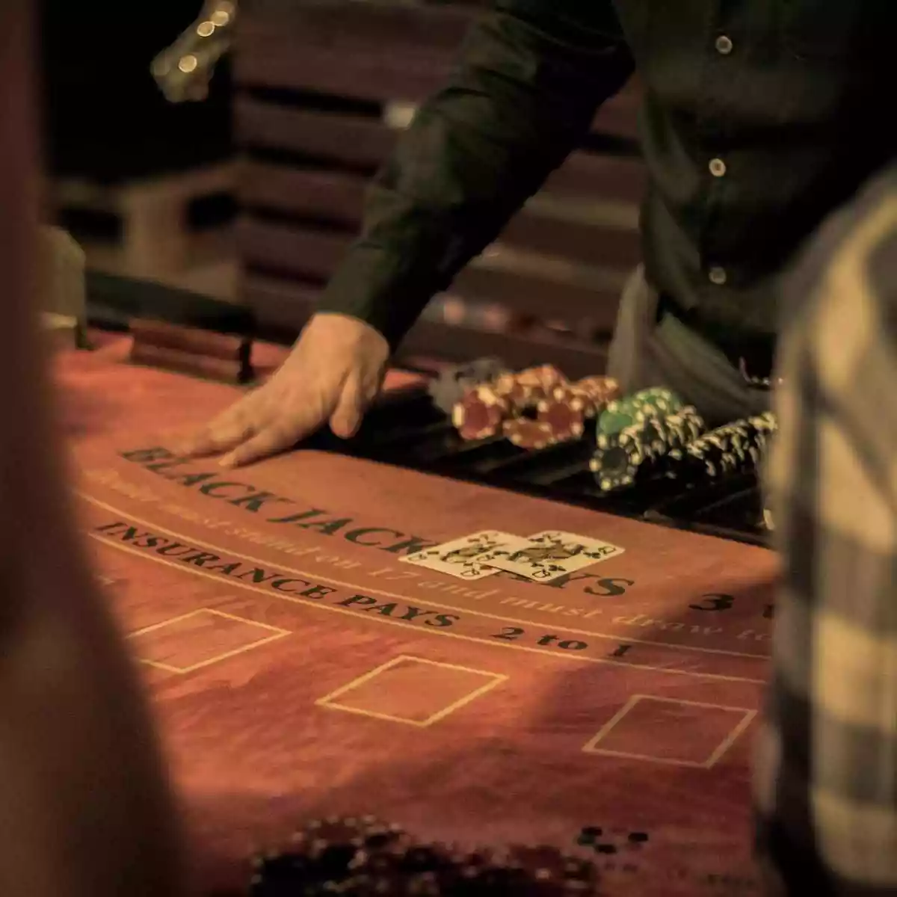

<body>
    <header>
        
        <h1>Apostando na sorte do número 21</h1>
        
Blackjack ou 21 é um jogo praticado com cartas em casinos e que pode ser jogado com 1 a 8 baralhos de 52 cartas, em que o objetivo é ter mais pontos, mas não ultrapassar 21.

        
 A pontuação mais alta possível recebe o nome de Blackjack, por isso o nome do jogo é esse. 

    </header>
</body>
</html>
